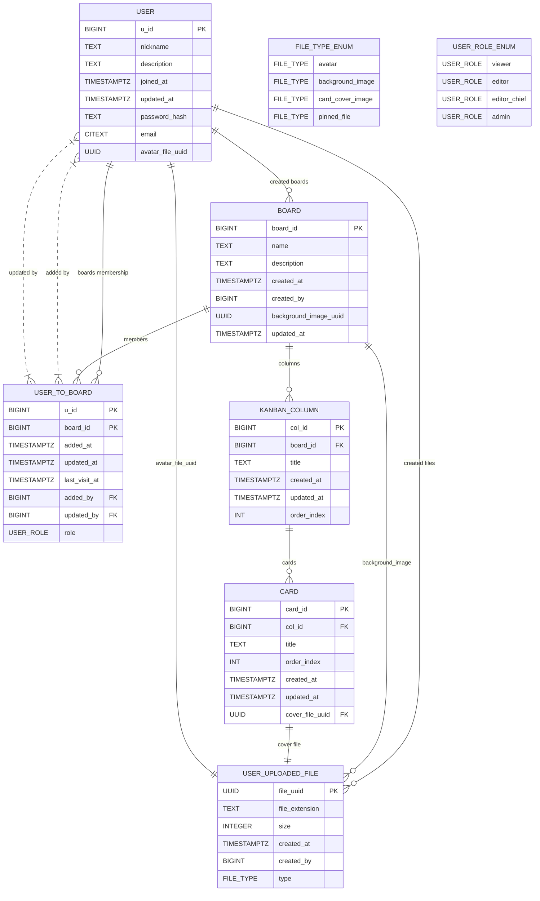

# Домашнее задание №1 по курсу СУБД

## Описание отношений

#### Отношение "Пользователь"

`{u_id} -> {nickname, description, joined_at, updated_at, password_hash, email, avatar_file_uuid}`

`{email} -> {u_id, nickname, description, joined_at, updated_at, password_hash, avatar_file_uuid}`

`{nickname} -> {u_id, email, description, joined_at, updated_at, password_hash, avatar_file_uuid}`

`{nickname, email} -> {u_id, description, joined_at, updated_at, password_hash, avatar_file_uuid}`

`{nickname, u_id} -> {email, description, joined_at, updated_at, password_hash, avatar_file_uuid}`

`{email, u_id} -> {nickname, description, joined_at, updated_at, password_hash, avatar_file_uuid}`

`{email, u_id, nickname} -> {description, joined_at, updated_at, password_hash, avatar_file_uuid}`

#### Отношение "Загруженный пользователем файл"

`{file_uuid} -> {file_extension, size, created_at, created_by, type}`

#### Отношение "Доска"

`{board_id} -> {name, description, created_at, created_by, background_image_uuid, updated_at}`

#### Отношение "Пользователь на доске"

`{u_id} -> {board_id, added_at, updated_at, last_visit_at, added_by, updated_by, role}`

`{board_id} -> {u_id, added_at, updated_at, last_visit_at, added_by, updated_by, role}`

`{u_id, board_id} -> {added_at, updated_at, last_visit_at, added_by, updated_by, role}`

#### Отношение "Колонка канбана"

`{col_id} -> {board_id, title, created_at, updated_at, order_index}`

#### Отношение "Карточка"

`{card_id} -> {col_id, title, order_index, created_at, updated_at, cover_file_uuid}`

#### Транзитивные отношения (справедливые не для любых кортежей)

`{user.avatar_file_uuid} -> {user_uploaded_file.type}` (только для некоторых файлов)

`{board.background_file_uuid} -> {user_uploaded_file.type}` (только для некоторых файлов)

`{user_to_board.added_by, user_to_board.u_id, user_to_board.created_by -> {board.created_by}` (только для кортежа user_to_board, где пользователь сам создал доску и на ней присутствует)

## Нормализация модели

### 1 Н.Ф.

1. _Нет упорядочивания строк сверху вниз (другими словами, порядок строк не несет в себе никакой информации)._

Везде, где порядок имеет значение, мы порядковый индекс использовали как атрибут кортежа. Наша модель данных не зависит от порядка кортежей.

2. _Нет упорядочивания столбцов слева направо (другими словами, порядок столбцов не несет в себе никакой информации)._

У нас каждый атрибут имеет уникальное имя, по которому мы его достаём. Мы не ориентируемся на порядок столбцов.

3. _Нет повторяющихся строк._

Все отношения имеют первичный ключ, который не может повторяться между строк, поэтому в любых двух кортежах одного отношения будет отличаться хотя бы первичный ключ.

4. _Каждое пересечение строки и столбца содержит ровно одно значение из соответствующего домена (и больше ничего)._

У нас нет массивов, поэтому это требование соблюдается.

5. _Все столбцы являются обычными_

Это свойство Postgres'а как реляционной СУБД. А, например, для Cassandra это утверждение не было бы справедливо

### 2 Н.Ф.

_Переменная отношения находится во второй нормальной форме тогда и только тогда, когда она находится в первой нормальной форме и каждый неключевой атрибут неприводимо зависит от (каждого) её потенциального ключа_

Наша модель находится в 2НФ, потому что каждый неключевой атрибут зависит только от первичного ключа

### 3 Н.Ф.

_Переменная отношения R находится в третьей нормальной форме тогда и только тогда, когда неключевые атрибуты непосредственно (нетранзитивно) функционально зависят от ключей_

Наша модель находится в третьей нормальной форме, потому что транзитивные зависимости справедливы не для всех кортежей, и каждый неключевой атрибут непосредственно зависит от первичного ключа

### НФБК

_Переменная отношения находится в НФБК тогда и только тогда, когда каждый её детерминант является потенциальным ключом_

Наша модель находится в НФБК, потому что во всех вышеприведённых отношениях атрибуты, находящиеся в левой части, позволяют однозначно определить кортеж в таблице (то есть, являются потенциальным ключом)

## ERD-диаграмма

