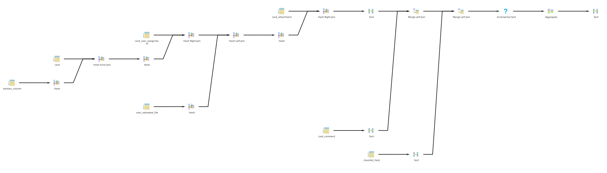

# Домашнее задание №3 по СУБД

## Заполнение базы данных

Заполняться будет одна доска. Будет создано 100 колонок, для каждой из них - 100 карточек.
В каждой второй карточке будет 10 вложений, 10 комментариев и 10 строк чеклиста.

Была создана доска с board_id=209 и тестовый пользователь с u_id=39

## Получение содержимого доски

### Откроем большую доску

Оно не вернуло список карточек. Это из-за того, что выражение отменено по таймауту. Почему не было 500-ки? Потому что pgx вернул ошибку `pgx.ErrNoRows`

Посмотрим на запрос, который был отменён:

```sql
SELECT
    c.card_id,
    c.col_id,
    c.title,
    c.created_at,
    c.updated_at,
    c.deadline,
    c.is_done,
    (SELECT (NOT COUNT(*)=0) FROM checklist_field AS f WHERE f.card_id=c.card_id),
    (SELECT (NOT COUNT(*)=0) FROM card_attachment AS f WHERE f.card_id=c.card_id),
    (SELECT (NOT COUNT(*)=0) FROM card_user_assignment AS f WHERE f.card_id=c.card_id),
    (SELECT (NOT COUNT(*)=0) FROM card_comment AS f WHERE f.card_id=c.card_id),
    COALESCE(uuf.file_uuid::text, ''),
    COALESCE(uuf.file_extension::text, ''),
    c.card_uuid
FROM card c
JOIN kanban_column kc ON c.col_id = kc.col_id
LEFT JOIN user_uploaded_file uuf ON c.cover_file_id = uuf.file_id
WHERE kc.board_id = $1
ORDER BY c.order_index;
```

Запрос содержит коррелирующие подзапросы. Скорее всего, именно они приводят к таймауту.

### Перепишем без коррелирующих подзапросов

```sql
SELECT
    c.card_id,
    c.col_id,
    c.title,
    c.created_at,
    c.updated_at,
    c.deadline,
    c.is_done,
    COUNT(clf.checklist_field_id)>0,
    COUNT(a.attachment_id)>0,
    COUNT(ua.assignment_id)>0,
    COUNT(com.comment_id)>0,
    COALESCE(uuf.file_uuid::text, ''),
    COALESCE(uuf.file_extension::text, ''),
    c.card_uuid
FROM card c
JOIN kanban_column kc ON c.col_id = kc.col_id
LEFT JOIN user_uploaded_file uuf ON c.cover_file_id = uuf.file_id
LEFT JOIN checklist_field clf ON clf.card_id=c.card_id
LEFT JOIN card_attachment a ON a.card_id=c.card_id
LEFT JOIN card_comment com ON com.card_id=c.card_id
LEFT JOIN card_user_assignment ua ON ua.card_id=c.card_id
WHERE kc.board_id = $1
GROUP BY c.card_id, uuf.file_id
ORDER BY c.order_index;
```

Теперь оно загружает доску за 10 секунд.

Теперь попробуем сделать stress-тестирование большой доски. Для этого был создан файл `run_vegeta.sh`:

```
=====
Start stress test
URL: https://kanban-pumpkin.ru/api/cards/board_209/allContent
Method: GET
Duration: 60s
Max workers: 2
=====
=====
Test finished! Creating report...
Requests      [total, rate, throughput]         13, 0.18, 0.17
Duration      [total, attack, wait]             1m18s, 1m12s, 5.755s
Latencies     [min, mean, 50, 90, 95, 99, max]  5.755s, 11.541s, 10.515s, 20.115s, 20.145s, 20.152s, 20.152s
Bytes In      [total, mean]                     34086823, 2622063.31
Bytes Out     [total, mean]                     0, 0.00
Success       [ratio]                           100.00%
Status Codes  [code:count]                      200:13
Error Set:
```

Мы видим, что запрос делается катастрофически долго. Пришлось даже ограничить количество воркеров, чтобы запросы не заканчивались по таймауту.

### Рассмотрим EXPLAIN и разработаем стратегию оптимизации



[План на explain.dalibo.com](https://explain.dalibo.com/plan/ffd95bg3537d6eb7)

### Индексы - попытка 1

Здесь есть очень "толстая" нода на Sort полей чеклиста после Sequential Scan. Можно попробовать добавить индекс на `checklist_field.card_id`. Также можно добавить индекс на `card_comment.card_id`:

```sql
CREATE INDEX pumpkin_idx0 ON checklist_field(card_id);
CREATE INDEX pumpkin_idx1 ON card_comment(card_id);
ANALYZE;
```

Сделаем стресс-тест большой доски:

```
=====
Start stress test
URL: https://kanban-pumpkin.ru/api/cards/board_209/allContent
Method: GET
Duration: 60s
Max workers: 2
=====
=====
Test finished! Creating report...
Requests      [total, rate, throughput]         12, 0.19, 0.17
Duration      [total, attack, wait]             1m12s, 1m2s, 9.894s
Latencies     [min, mean, 50, 90, 95, 99, max]  9.84s, 11.78s, 10.863s, 15.969s, 15.988s, 15.991s, 15.991s
Bytes In      [total, mean]                     37178244, 3098187.00
Bytes Out     [total, mean]                     0, 0.00
Success       [ratio]                           100.00%
Status Codes  [code:count]                      200:12
Error Set:
```

Как мы видим, индексы не помогли. Удалим их вообще.

[План на explain.dalibo.com](https://explain.dalibo.com/plan/4eb3f729a36c8754)

### Грамотно сделать некоррелирующий подзапрос

После JOIN-а получаются миллионы кортежей. Это очень плохо, хотя всего вложений и полей чеклиста на доске намного меньше (50к). Можно попытаться отказаться от JOIN-ов вообще:

```sql
SELECT
    c.card_id,
    c.col_id,
    c.title,
    c.created_at,
    c.updated_at,
    c.deadline,
    c.is_done,
	c.card_id IN (SELECT DISTINCT f.card_id
		FROM checklist_field f
		JOIN card c ON c.card_id=f.card_id
		JOIN kanban_column k ON c.col_id=k.col_id
		WHERE k.board_id=209),
	c.card_id IN (SELECT DISTINCT f.card_id
		FROM card_attachment f
		JOIN card c ON c.card_id=f.card_id
		JOIN kanban_column k ON c.col_id=k.col_id
		WHERE k.board_id=209),
	c.card_id IN (SELECT DISTINCT f.card_id
		FROM card_user_assignment f
		JOIN card c ON c.card_id=f.card_id
		JOIN kanban_column k ON c.col_id=k.col_id
		WHERE k.board_id=209),
	c.card_id IN (SELECT DISTINCT f.card_id
		FROM card_comment f
		JOIN card c ON c.card_id=f.card_id
		JOIN kanban_column k ON c.col_id=k.col_id
		WHERE k.board_id=209),
    COALESCE(uuf.file_uuid::text, ''),
    COALESCE(uuf.file_extension::text, ''),
    c.card_uuid
FROM card c
JOIN kanban_column kc ON c.col_id = kc.col_id
LEFT JOIN user_uploaded_file uuf ON c.cover_file_id = uuf.file_id
WHERE kc.board_id = 209
GROUP BY c.card_id, uuf.file_id
ORDER BY c.order_index;
```

Теперь запрос стал намного быстрее!

Сделаем стресс-тест большой доски:

```
=====
Start stress test
URL: https://kanban-pumpkin.ru/api/cards/board_209/allContent
Method: GET
Duration: 60s
Max workers: 4
=====
=====
Test finished! Creating report...
Requests      [total, rate, throughput]         171, 2.81, 2.78
Duration      [total, attack, wait]             1m2s, 1m1s, 648.243ms
Latencies     [min, mean, 50, 90, 95, 99, max]  648.243ms, 1.429s, 1.335s, 2.148s, 2.32s, 2.467s, 2.532s
Bytes In      [total, mean]                     529789977, 3098187.00
Bytes Out     [total, mean]                     0, 0.00
Success       [ratio]                           100.00%
Status Codes  [code:count]                      200:171
Error Set:
```

Стало значительно лучше!

[План запроса на explain.dalibo.com](https://explain.dalibo.com/plan/56ce7bd9dgf889a1)

### Подзапросы - попытка улучшить за счёт CTE

Можно сразу найти список всех card_id и для них искать checklist_field и т.д.

Это дало время выполнения запроса 457 мс. Это открывает возможности по применению индексов.

[План запроса на explain.dalibo.com](https://explain.dalibo.com/plan/54a9f1e293029e91)

### Индексы - попытка №2

Можно попробовать оптимизировать подзапросы, применяя индексы. Тогда будет применяться Merge Join:

```sql
CREATE INDEX pumpkin_idx0 ON checklist_field(card_id);
CREATE INDEX pumpkin_idx1 ON card_attachment(card_id);
CREATE INDEX pumpkin_idx2 ON card_comment(card_id);
CREATE INDEX pumpkin_idx4 ON card(col_id);
CREATE INDEX pumpkin_idx5 ON kanban_column(board_id);
ANALYZE;
```

Теперь выполняется за 341 мс.

[План запроса на explain.dalibo.com](https://explain.dalibo.com/plan/5d1f0474gfb19c61)

### Выводы

В реальной жизни столько карточек не будет добавлено на доску. Но мы добились того, чтобы база корректно отрабатывала и не уходила в таймаут.

А теперь сравним планы запросов для маленькой доски до и после добавления индексов:

[План до добавления индексов и переписывания запроса (320 мс)](https://explain.dalibo.com/plan/ga6dbffb671fcfde)

[План после добавления индексов и переписывания запроса (47 мс)](https://explain.dalibo.com/plan/e877c8639h478b80)

Раньше sequential scan в коррелирующих подзапросах отсеивал очень много данных, и это было очень плохо.

Дальнейшее улучшение производительности можно получить за счёт денормализации.
